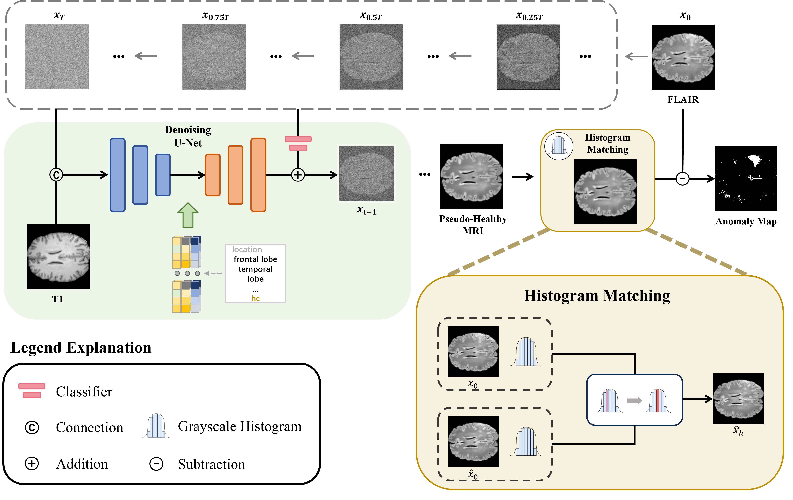
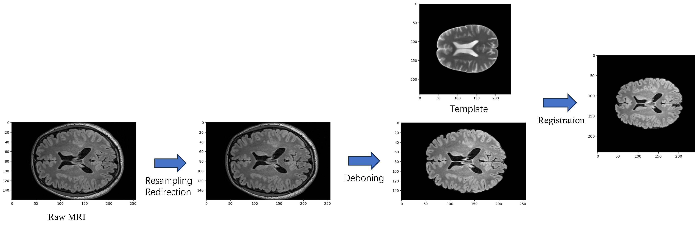
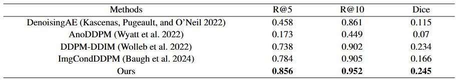
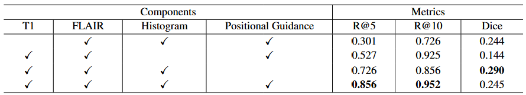

# Pseudo-Healthy Image Synthesis via Location-Guided Diffusion Models for Focal Cortical Dysplasia Lesion Localization



Focal cortical dysplasia (FCD) is a developmental disorder frequently linked to drug-resistant focal epilepsy, where surgical intervention is often the most promising treatment. Unfortunately, conventional neuroradiological methods often struggle to detect subtle FCD cases, which may result in missed surgical opportunities for patients. To address this challenge, we have developed an innovative approach to FCD lesions detection using conditional diffusion models guided by complementary location-based modal factors. Our method involves employing a classifier to identify epileptic sites while directing the diffusion model to generate pseudo-healthy images. Using the unique features of FCD present in both T1 and FLAIR images, T1 images conditions the diffusion model to produce the corresponding FLAIR image, effectively removing abnormal tissue. Recognizing the difficulty in detecting epileptic lesions due to their subtle presentation, we have incorporated histogram matching techniques to address the color distortion issues commonly associated with diffusion models. This adjustment ensures that chromatic aberration does not hinder the identification of lesions. The effectiveness of our method has been validated using the UHB FCD MRI dataset, achieving an image-level recall metric of 0.952 and a pixel-level dice metric of 0.245. These results surpass those obtained from four other comparative methods, underscoring the superior performance of our approach. Our anonymous code is available in Supplementary Material.

## Dataset
This article uses an openly open dataset (UHB dataset) provided by the Department of Epilepsy at the University Hospital Bonn. The dataset published at the University Hospital of Bonn collected 85 patients hospitalized between 2006 and 2021 with a confirmed diagnosis of FCD II and included 85 healthy controls, each with two MRI sequences, T1 and FLAIR, and their clinical information.
### Download
[An open presurgery MRI dataset of people with epilepsy and focal cortical dysplasia type II.](https://openneuro.org/datasets/ds004199/versions/1.0.5)

### Preprocess

1. Resampling and redirection.
2. Use [HD-BET](https://github.com/MIC-DKFZ/HD-BET) for deboning.
3. Use [sri24_spm8](https://www.nitrc.org/projects/sri24/) registration.
4. Slice.

## Method
### Train Classifier
```
t = torch.randint(0, self.num_timesteps, (x_start.shape[0],), device=self.device).long()
noise = torch.randn_like(x_start, device=self.device)
x_noisy = self.noise_scheduler.add_noise(x_start, noise, t).to(self.device)

logits = self(x_noisy, t，cond)
loss = F.cross_entropy(logits, is_fcd, reduction="none").mean()
```

### Train Diffusion Model
```
t = torch.randint(0, self.num_timesteps, (x_start.shape[0],), device=self.device).long()
noise = torch.randn_like(x_start, device=self.device)
x_noisy = self.noise_scheduler.add_noise(x_start, noise, t).to(self.device)

x_noisy = torch.cat((x_noisy, cond_img), dim=1)

model_out = self.model(x_noisy, t, y=label)
target = noise
pred = model_out
loss = torch.nn.functional.mse_loss(target, pred, reduction='none')
```
### Inference
```
self.classifier_model = instantiate_from_config(self.classifier_config).to(device).eval()
self.noise_scheduler.set_timesteps(self.infer_step, device=device)
self.inverse_scheduler.set_timesteps(self.infer_step, device=device)

noise = torch.randn_like(x_start, device=self.device)
t = torch.full((x_start.shape[0],), 0, device=self.device, dtype=torch.long)
x_t = self.noise_scheduler.add_noise(x_start, noise, t).to(self.device)

label = torch.zeros_like(label[:N]).to(self.device)
reverse_timesteps = list(sample_timesteps)[::-1]
with torch.no_grad():
    for t in reverse_timesteps[1:]:
        model_out = self.model(model_input, t_batch, y=y)
        x_t = self.inverse_scheduler.step(model_out, t, x_t, False)[0]
    for t in sample_timesteps:
        model_out = self.model(model_input, t_batch, y=y)
        x_t = self.noise_scheduler.step(model_out, t, x_t, eta=self.eta, use_clipped_model_output=True).prev_sample
        x_t += self.cond_fn(x_t, t_batch, y, self.guide_w)
```
Use config_t1_cond_multiclass_cg.yaml files for inference.
```
python main.py --base ./configs/config_t1_cond_multiclass_cg.yaml --test True
```
[Download our models.]()

## Experiment


### Evaluation Metrics
We evaluate our model's performance using recall (denoted as R@k), which measures the detection of false positives per image at the pixel level, alongside Dice metrics. A lesion is considered recalled if there is at least one predicted point within 10 pixels of the lesion, aligning with the 5th percentile of lesion radius across both datasets. The Dice metric is computed by binarizing the anomaly map, and the threshold is chosen by picking the value that maximizes the Dice metric based on the range of anomalous pixels. Measurements were conducted on slices sized 256 × 256 pixels.

### Comparative Study


### Ablation Study

